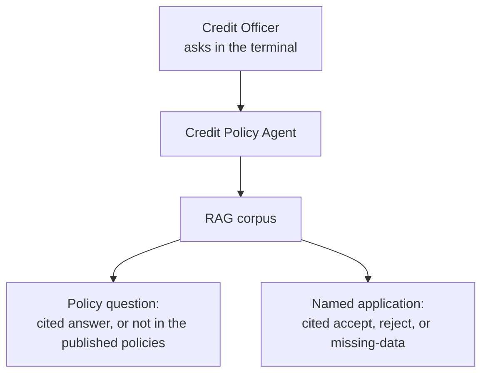
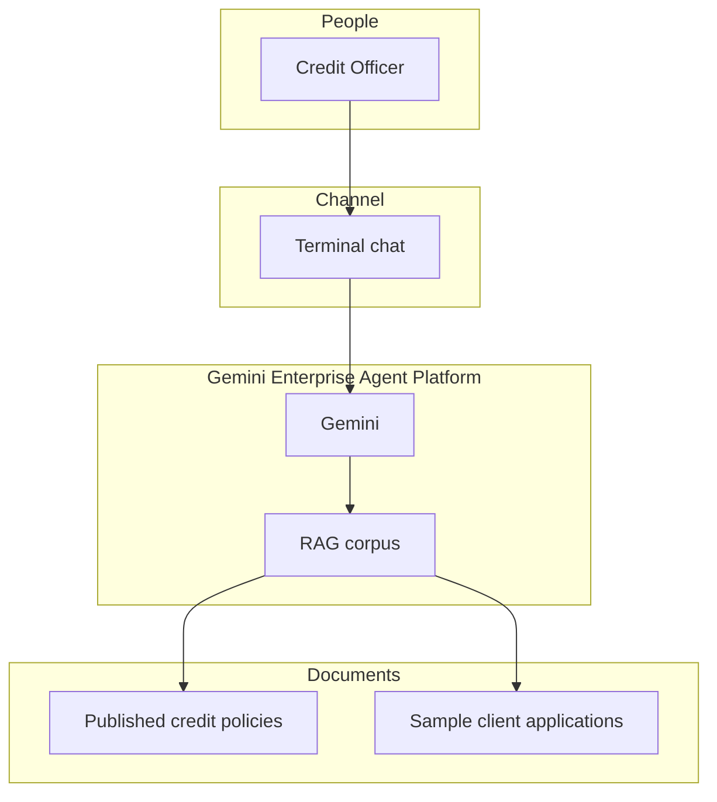
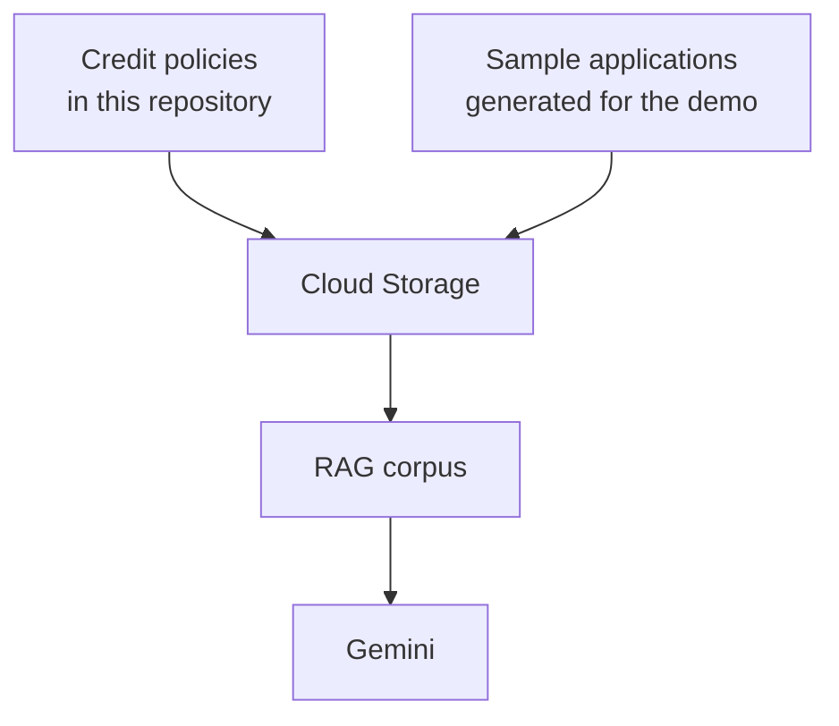

# Bank Credit Policy Agent Demo

A Gemini assistant that evaluates client applications against published credit policy and helps a credit officer process the file — with citations.

## Executive Summary

Credit officers process applications against published policy: read the filing, check LTV, DTI, and required documents, and record a decision. Today that means paging through policy PDFs while the deal is live. Generic chat models invent thresholds, committees, and eligibility rules.

This repository is a **demo**, not a production origination system. It shows a Gemini Enterprise Agent Platform assistant that evaluates client applications and helps the credit officer work the file from the terminal. Name an application by number or customer; the agent compares it to twelve Contoso Demo Bank credit-policy documents, flags missing items, and returns a cited judgement — accept, reject, or missing-data. Policy lookup is in service of that workflow. If the published policies do not cover the question, the agent says so rather than guessing.

This is the same demo as [kborovik/azure-ai-foundry](https://github.com/kborovik/azure-ai-foundry), on Google Cloud instead of Microsoft Foundry. Document generation is the same: policies render from `corpus/`, and sample applications are minted by the model from the same prompts and schema.

## How it works

**How a credit officer gets an answer**

**The agent does two jobs:**

- **Policy Q&A** — quote the number, the conditions, and the source document.
- **Application evaluation** — compare a sample filing to published policy and return accept, reject, or missing-data. Findings cite the retrieved documents.

## Design

One model, one RAG corpus, one terminal chat. Published policy is the source of truth; sample applications are the files being judged; the model is not.

**How documents reach the corpus**

Credit policies live in this repository. Sample applications are generated for the demo. Both are stored, then imported into one corpus.

Google Cloud underneath is one project with a private document bucket, RAG Engine, and the chat and embedding models the agent uses.

## Deploying the demo

Terraform in `infra/` stands up Google Cloud. The `talos` CLI loads `data/` and grounds Gemini on the corpus. See [docs/demo.md](docs/demo.md).

1. **Google Cloud resources (`infra/`).** Terraform runs in the existing project `lab5-gemini-dev1` (`us-east1`). It creates document storage and the RAG Engine. State is stored in `terraform-lab5-gemini-dev1`, the bucket the org factory already created for that project.

2. **Documents (`data/`).** The twelve credit policies (rendered from `corpus/` into `data/credit-policies/`) and the sample applications in `data/client-applications/` are stored and imported. Until this step finishes, the agent has nothing grounded to quote.

3. **Prompt.** Gemini answers only from the RAG corpus, using the instructions in `agents/`. It cannot invent LTV, DTI, or committee names, and it will not override published policy.

4. **Chat.** `talos chat` is the credit-officer client. A later version can put the same corpus behind Google Chat. This demo does not ship that channel.

A production release repeats the document and import steps against the live project: refresh documents, re-import, keep the model pointed at the published policies. Every code change is tested automatically; secrets are not stored in git.

## Layout

| Path | Role |
| --- | --- |
| `infra/` | Terraform: APIs, document bucket, RAG Engine, agent service account |
| `corpus/` | Policy facts and templates, plus the application-generation prompts |
| `data/credit-policies/` | The twelve rendered policy documents |
| `agents/` | System instructions loaded on every chat |
| `src/talos/` | `talos` CLI: generate, deploy, chat |
