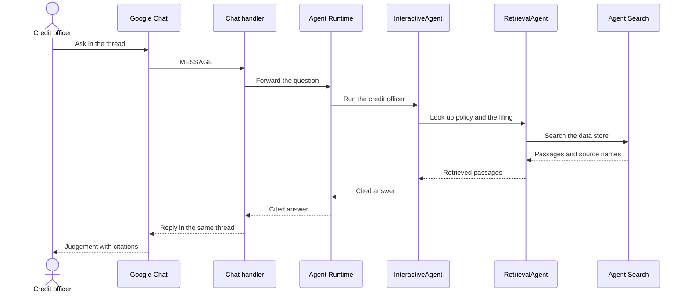
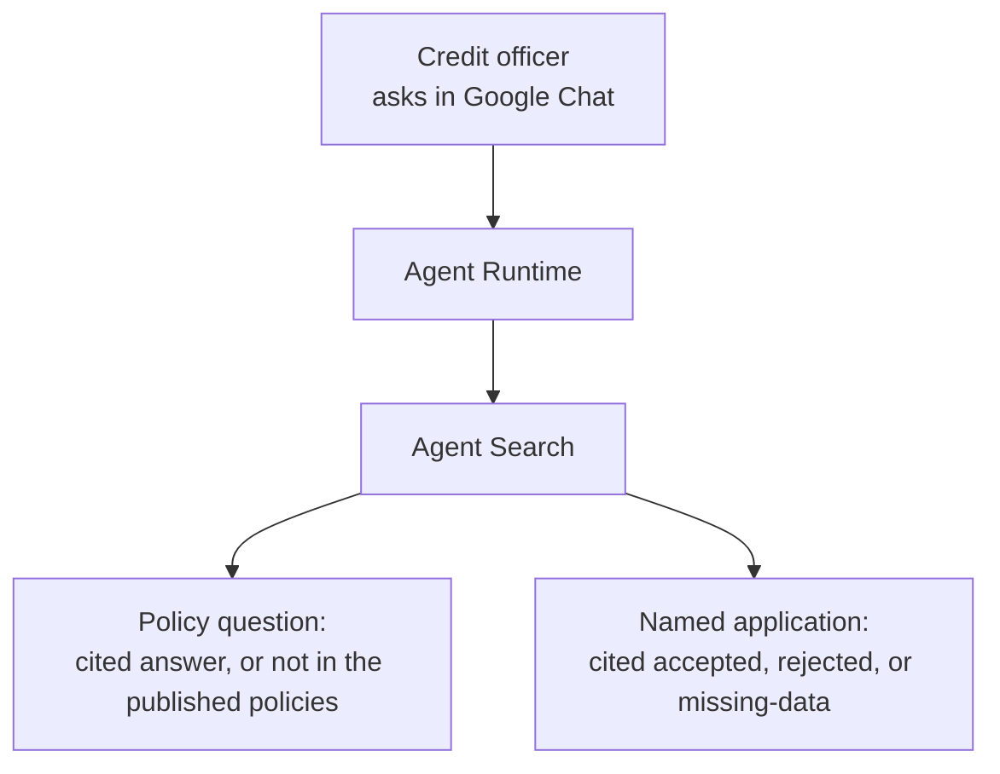
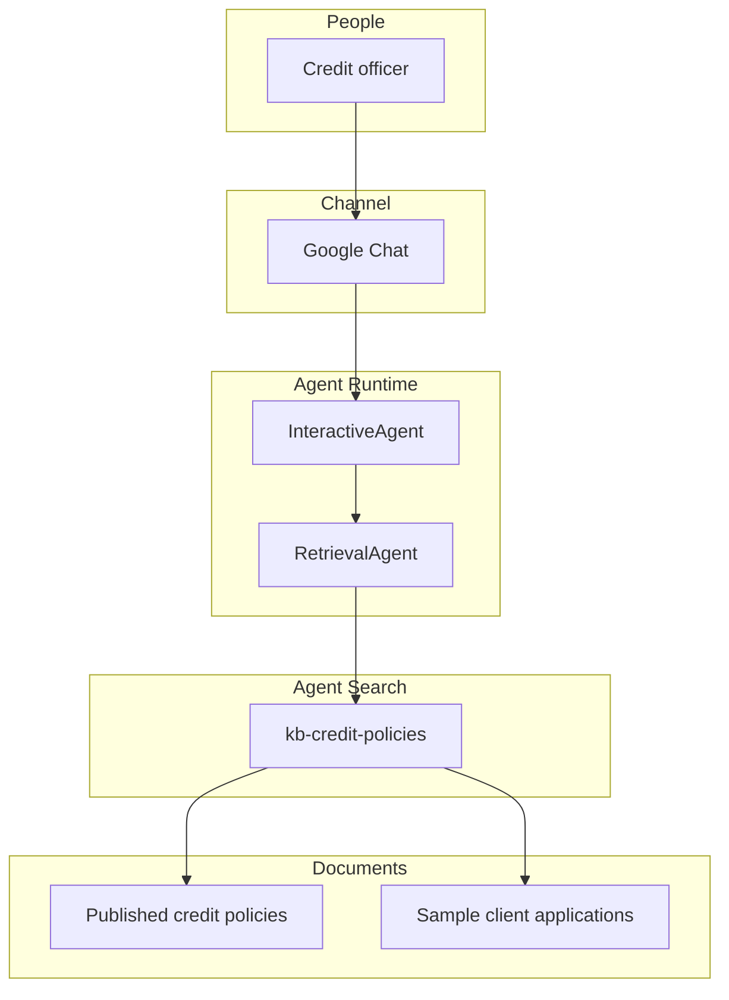

# Bank Credit Policy Agent Demo

A credit officer asks in Google Chat. An agent on Agent Runtime answers from published credit policy, with citations.

## Executive Summary

Credit officers process applications against published policy. They read the filing, check loan-to-value (LTV), debt-to-income (DTI), and required documents, and record a decision. Today that means paging through policy PDFs while the deal is live. A generic chat model invents thresholds, committees, and eligibility rules.

This repository is a demo of that workflow. It is not a production origination system. The officer names an application by number or customer name in Google Chat. The agent compares that filing to twelve Contoso Demo Bank credit-policy documents, flags missing items, and returns a cited judgement: accepted, rejected, or missing-data. When the published policies do not cover the question, the agent says so.

This is the same demo as [kborovik/azure-ai-foundry](https://github.com/kborovik/azure-ai-foundry), on Google Cloud. Document generation is unchanged. Policies render from `corpus/`. Sample applications are minted by the model from the same prompts.

## How it works

The officer writes in Google Chat. A thin handler forwards the message to the agent on Agent Runtime. The agent searches one Agent Search data store that holds the policies and the sample applications, then answers in the same thread. Agent Search owns the document embeddings.

### Question path

### Two outcomes

The agent does two jobs:

- Policy Q&A. Quote the number, the conditions, and the source document.
- Application evaluation. Compare a sample filing to published policy and return accepted, rejected, or missing-data.

## Design

Two agents share one model, `gemini-3.8-flash`. InteractiveAgent holds the credit-officer instructions and calls RetrievalAgent. RetrievalAgent searches the one data store. Published policy is the source of truth. Sample applications are the files being judged.

### The pieces

Policies live in this repository. Sample applications are generated for the demo. Both land in Cloud Storage, then in the data store. The steps to stand the demo up are in [docs/demo.md](docs/demo.md).

## Layout

| Path | Role |
| --- | --- |
| `infra/` | Terraform: APIs, document bucket, agent service account |
| `corpus/` | Policy facts and templates, plus the application-generation prompts |
| `data/credit-policies/` | The twelve rendered policy documents |
| `agents/credit_officer/` | InteractiveAgent and RetrievalAgent |
| `src/docgen/` | `docgen`: generate documents and upload them |
